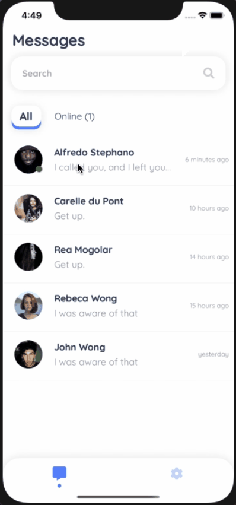

# Free Chat

__Chat freely with anybody.__

This is a sample Xamarin.Forms application demonstrating how to build a user interface for a chat app.
Inspired [by]([https://dribbble.com/shots/10446738-Direct-messaging-mobile-app-design])

<html>
  <table style="width:100%">
    <tr>
      <th>Android Demo</th>
      <th>Home</th> 
    </tr>
    <tr>
      <td></td>
      <td></td>
    </tr>
  </table>
</html>
